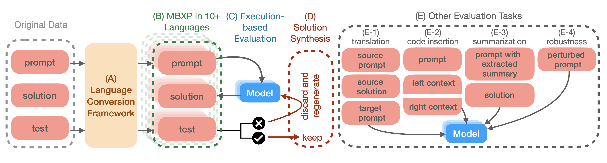
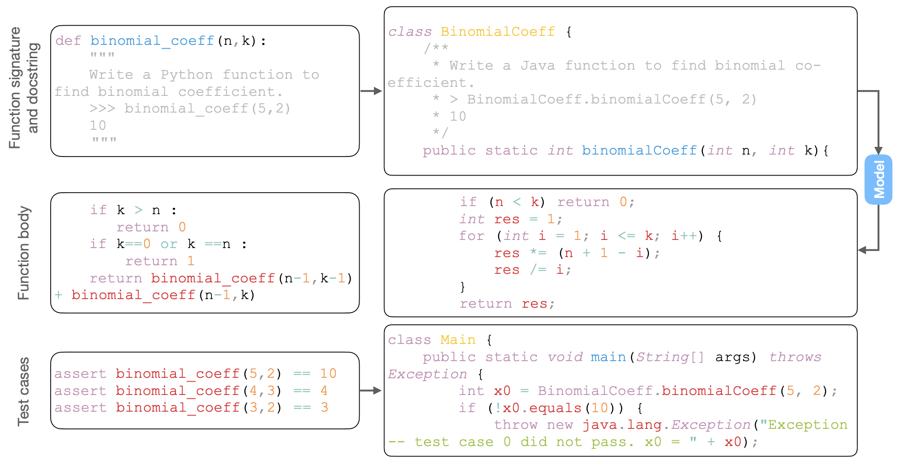

# Execution-based evaluation of code in 10+ languages

This repository contains code to perform execution-based multi-lingual evaluation of code generation capabilities and the corresponding data, namely, a multi-lingual benchmark MBXP, multi-lingual MathQA and multi-lingual HumanEval. Results and findings can be found in the paper "Multi-lingual Evaluation of Code Generation Models" (https://arxiv.org/abs/2210.14868).


## Paper summary

Our paper describes the language conversion framework, the synthetic solution generation, and many other types of evaluation beyond the traditional function completion evaluation such as translation, code insertion, summarization, and robustness evaluation. 




## Language conversion of execution-based function completion datasets

Below we demonstrate the language conversion (component A above) for the conversion from Python to Java (abridged example for brevity). 




# Installation

Check out and install this repository:
```
git clone https://github.com/amazon-science/mxeval.git
pip install -e mxeval
```


## Dependencies
We provide scripts to help set up programming language dependencies that are used to execute and evaluate using datasets in MBXP.

### Amazon Linux AMI
```
bash language_setup/amazon_linux_ami.sh
```
### Ubuntu
```
bash language_setup/ubuntu.sh
```

# Usage

**This program exists to run untrusted model-generated code. Users are strongly
encouraged not to do so outside of a robust security sandbox. See the comment in
`execution.py` for more information and instructions.**

Each sample is formatted into a single line:
```
{"task_id": "Corresponding task ID", "completion": "Completion only without the prompt",
"language": "programming language name"}
```
We provide `data/mbxp/examples/mbxp_samples.jsonl` to illustrate the format. 

Here is nearly functional example code (you just have to provide
`generate_one_completion` to make it work) that saves generated completions to
`samples.jsonl`.
```
from mxeval.data import write_jsonl, read_problems

problems = read_problems()

num_samples_per_task = 200
samples = [
    dict(task_id=task_id, language=problems[task_id]["language"], completion=generate_one_completion(problems[task_id]["prompt"]))
    for task_id in problems
    for _ in range(num_samples_per_task)
]
write_jsonl("samples.jsonl", samples)
```

To evaluate the samples for, e.g., Java MBJP evaluation, run 
```
evaluate_functional_correctness data/mbxp/examples/mbjp_samples.jsonl --problem_file data/mbxp/mbjp_release_v1.jsonl
```
or to run all languages
```
for lang in mbcpp mbcsp mbgp mbjp mbjsp mbkp mbphp mbplp mbpp mbrbp mbscp mbswp mbtsp;
  do evaluate_functional_correctness --problem_file data/mbxp/${lang}_release_v1.jsonl data/mbxp/examples/${lang}_samples.jsonl;
done
```
You can check the programming-language dependency installation by running the above example for each MBXP dataset. You should obtain the following results for the mbxp_samples.jsonl files provided:


| Dataset | pass@1 |
|---------|--------|
| MBCPP   | 79.60% |
| MBCSP   | 63.63% |
| MBGP    | 39.19% |
| MBJP    | 85.30% |
| MBJSP   | 78.67% |
| MBKP    | 63.77% |
| MBPHP   | 72.77% |
| MBPLP   | 38.41% |
| MBPP    | 82.24% |
| MBRBP   | 58.90% |
| MBSCP   | 42.96% |
| MBSWP   | 29.40% |
| MBTSP   | 87.29% |


Note: Because there is no unbiased way of estimating pass@k when there are fewer
samples than k, the script does not evaluate pass@k for these cases. To
evaluate with other k values, pass `--k <comma-separated-values-here>`. For
other options, see
```
$ evaluate_functional_correctness --help
```
However, we recommend that you use the default values for the rest.

### Example usage with non-default values
```
evaluate_functional_correctness  data/mbxp/samples/mbjp_samples.jsonl --problem_file data/mbxp/mbjp_release_v1.jsonl --n_workers 63 --k 1,5,10,100
```

### Known Issues

While evaluation uses very little memory, you might see the following error
message when the system is running out of RAM. Since this may cause some
correct programs to fail, we recommend that you free some memory and try again.
```
malloc: can't allocate region
```

Some system might require longer compilation timeout. If you see that the execution fails due to compilation timeout reason, this number should be increased accordingly.

### Canonical solutions release

We have released canonical solutions for certain popular langauges (v1.2). The detailed numbers of the solutions for each langauge are listed below. 

| Dataset | # solutions | # problems |
|---------|-------------|------------|
| MBCPP   |     773     |     848    |
| MBCSP   |     725     |     968    |
| MBJP    |     874     |     966    |
| MBJSP   |     938     |     966    |
| MBKP    |     796     |     966    |
| MBPHP   |     950     |     966    |
| MBPP    |     960     |     974    |
| MBRBP   |     784     |     966    |
| MBTSP   |     967     |     968    |


### Future release
We plan to release synthetic canonical solutions as well as processed datasets for other evaluation tasks such as code-insertion, code-translation, etc. 


### Credits
We adapted OpenAI's human-eval package (https://github.com/openai/human-eval) for the multi-lingual case. We thank OpenAI for their pioneering effort in this field including the release of the original HumanEval dataset, which we convert to the multi-lingual versions. We also thank Google for their release of the original MBPP Python dataset (https://github.com/google-research/google-research/tree/master/mbpp), which we adapt and convert to other programming languages.

### Citation

Please cite using the following bibtex entry:

```
@article{mbxp_athiwaratkun2022,
  title = {Multi-lingual Evaluation of Code Generation Models},
  author = {Athiwaratkun, Ben and
   Gouda, Sanjay Krishna and
   Wang, Zijian and
   Li, Xiaopeng and
   Tian, Yuchen and
   Tan, Ming
   and Ahmad, Wasi Uddin and
   Wang, Shiqi and
   Sun, Qing and
   Shang, Mingyue and
   Gonugondla, Sujan Kumar and
   Ding, Hantian and
   Kumar, Varun and
   Fulton, Nathan and
   Farahani, Arash and
   Jain, Siddhartha and
   Giaquinto, Robert and
   Qian, Haifeng and
   Ramanathan, Murali Krishna and
   Nallapati, Ramesh and
   Ray, Baishakhi and
   Bhatia, Parminder and
   Sengupta, Sudipta and
   Roth, Dan and
   Xiang, Bing},
  doi = {10.48550/ARXIV.2210.14868},
  url = {https://arxiv.org/abs/2210.14868},
  keywords = {Machine Learning (cs.LG), Computation and Language (cs.CL), FOS: Computer and information sciences, FOS: Computer and information sciences},
  publisher = {arXiv},
  year = {2022},
  copyright = {Creative Commons Attribution 4.0 International}
}

```
